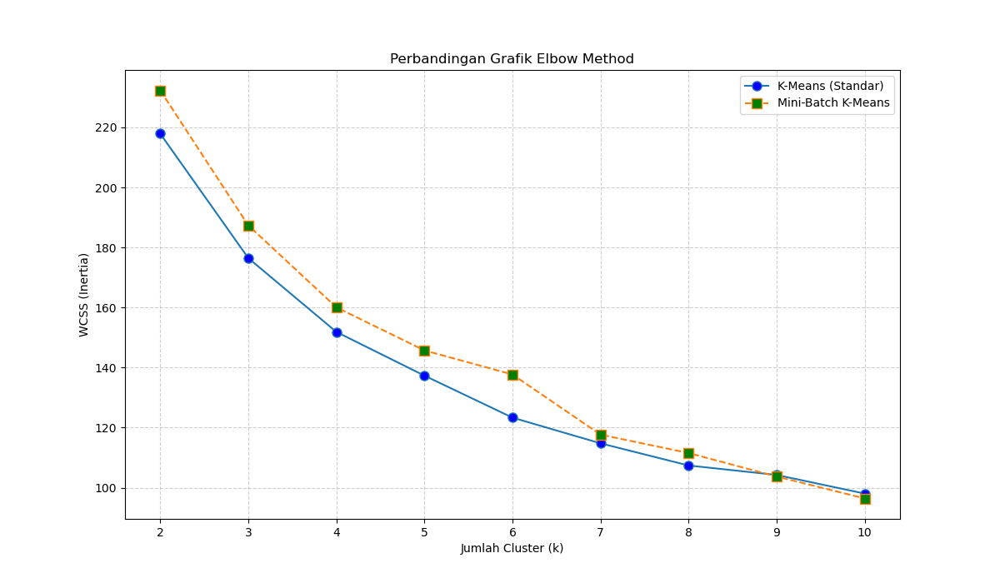
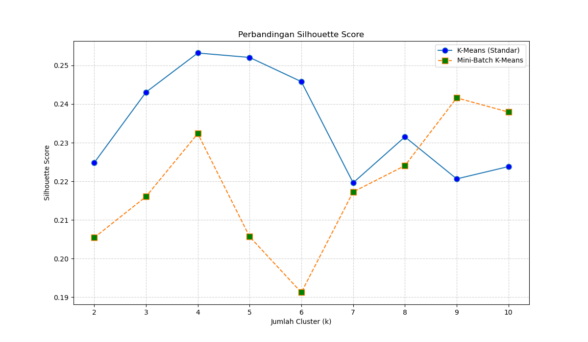
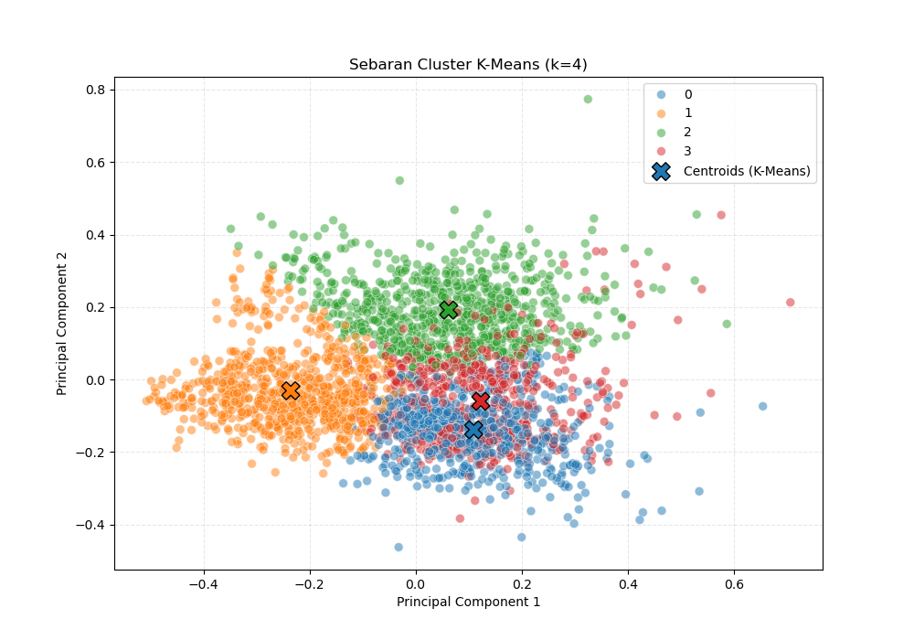
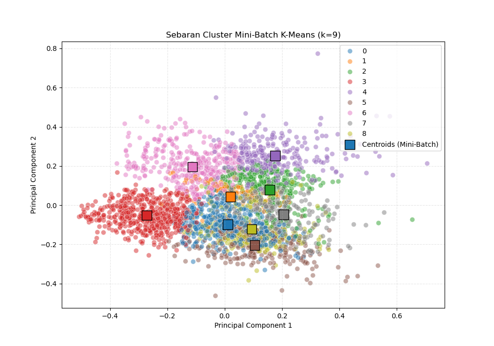

# K-Means vs Mini-Batch K-Means Clustering Analysis

A comprehensive comparison of K-Means and Mini-Batch K-Means clustering algorithms on air quality data, featuring automatic parameter tuning and detailed performance analysis.

## 📋 Table of Contents
- [Overview](#overview)
- [Features](#features)
- [Installation](#installation)
- [Usage](#usage)
- [Results](#results)
- [Output Files](#output-files)

## 🎯 Overview

This project performs a head-to-head comparison between standard K-Means and Mini-Batch K-Means clustering algorithms. It automatically evaluates cluster numbers from k=2 to k=10, using both the Elbow Method and Silhouette Score to determine optimal clustering configurations.

**Features analyzed:**
- PM10 (pm_sepuluh)
- PM2.5 (pm_duakomalima)
- Sulfur Dioxide (sulfur_dioksida)
- Carbon Monoxide (karbon_monoksida)
- Ozone (ozon)
- Nitrogen Dioxide (nitrogen_dioksida)

## ✨ Features

- **Automated parameter tuning** (k=2 to k=10)
- **Dual algorithm comparison** (K-Means vs Mini-Batch K-Means)
- **Multiple evaluation metrics** (WCSS, Silhouette Score, Execution Time)
- **PCA visualization** for cluster interpretation
- **Smart sampling** for large datasets (>10k rows)
- **Comprehensive reporting** (CSV, Excel, PNG outputs)

## 🚀 Installation

### Prerequisites
```bash
Python 3.7+
```

### Required Libraries
```bash
pip install pandas numpy matplotlib seaborn scikit-learn openpyxl
```

Or install from requirements.txt:
```bash
pip install -r requirements.txt
```

## 💻 Usage

1. Run the analysis:
```bash
python main.py
```
2. Check the `output/` folder for results

## 📊 Results

### Elbow Method Comparison


The Elbow Method helps identify the optimal number of clusters by plotting WCSS (Within-Cluster Sum of Squares) against different k values. The "elbow point" indicates where adding more clusters provides diminishing returns.

### Silhouette Score Comparison


Silhouette Score measures how well each data point fits within its assigned cluster. Higher scores indicate better-defined clusters. This comparison shows the performance difference between K-Means and Mini-Batch K-Means across different k values.

### K-Means Cluster Visualization (PCA)


PCA (Principal Component Analysis) reduces the 6-dimensional feature space to 2D for visualization. This plot shows how K-Means groups the air quality data into distinct clusters.

### Mini-Batch K-Means Cluster Visualization (PCA)


Similar to the K-Means visualization, but using the Mini-Batch algorithm which is optimized for larger datasets through batch processing.

## 📁 Output Files

After running the analysis, the following files are generated in the `output/` folder:

| File | Description |
|------|-------------|
| `comparison_auto_elbow_method.png` | Elbow method comparison chart |
| `comparison_auto_silhouette_score.png` | Silhouette score comparison chart |
| `comparison_auto_pca_kmeans_k*.png` | K-Means PCA visualization |
| `comparison_auto_pca_minibatch_k*.png` | Mini-Batch K-Means PCA visualization |
| `hasil_tabel_perbandingan_tuning.csv` | Complete performance metrics table |
| `comparison_auto_profil_klaster.xlsx` | Cluster profiles with centroids |
| `comparison_auto_data_labeled.csv` | Original data with cluster labels |

### Performance Metrics Table
The `hasil_tabel_perbandingan_tuning.csv` contains:
- WCSS values for both algorithms
- Silhouette scores for both algorithms
- Execution time comparisons
- Optimal k recommendations

### Cluster Profiles Excel
The `comparison_auto_profil_klaster.xlsx` contains:
- Sheet 1: K-Means cluster centroids and member counts
- Sheet 2: Mini-Batch K-Means cluster centroids and member counts

## 🔍 Algorithm Comparison

### K-Means (Standard)
- **Pros:** More accurate cluster assignments
- **Cons:** Slower on large datasets
- **Best for:** Smaller datasets (<10k rows) where accuracy is priority

### Mini-Batch K-Means
- **Pros:** Much faster on large datasets
- **Cons:** Slightly less accurate than standard K-Means
- **Best for:** Large datasets (>10k rows) where speed matters

## 📈 Interpretation Guide

### WCSS (Inertia)
- **Lower is better**
- Look for the "elbow" where the rate of decrease slows
- Typical range: Varies by dataset scale

### Silhouette Score
- **Range:** -1 to 1
- **>0.5:** Good clustering
- **0.25-0.5:** Reasonable clustering
- **<0.25:** Poor clustering

### Execution Time
- Standard K-Means is typically 2-5x slower than Mini-Batch
- Gap widens with larger datasets

## 🙏 Acknowledgments

- Scikit-learn for clustering implementations
- Matplotlib & Seaborn for visualizations
- Pandas for data manipulation

---